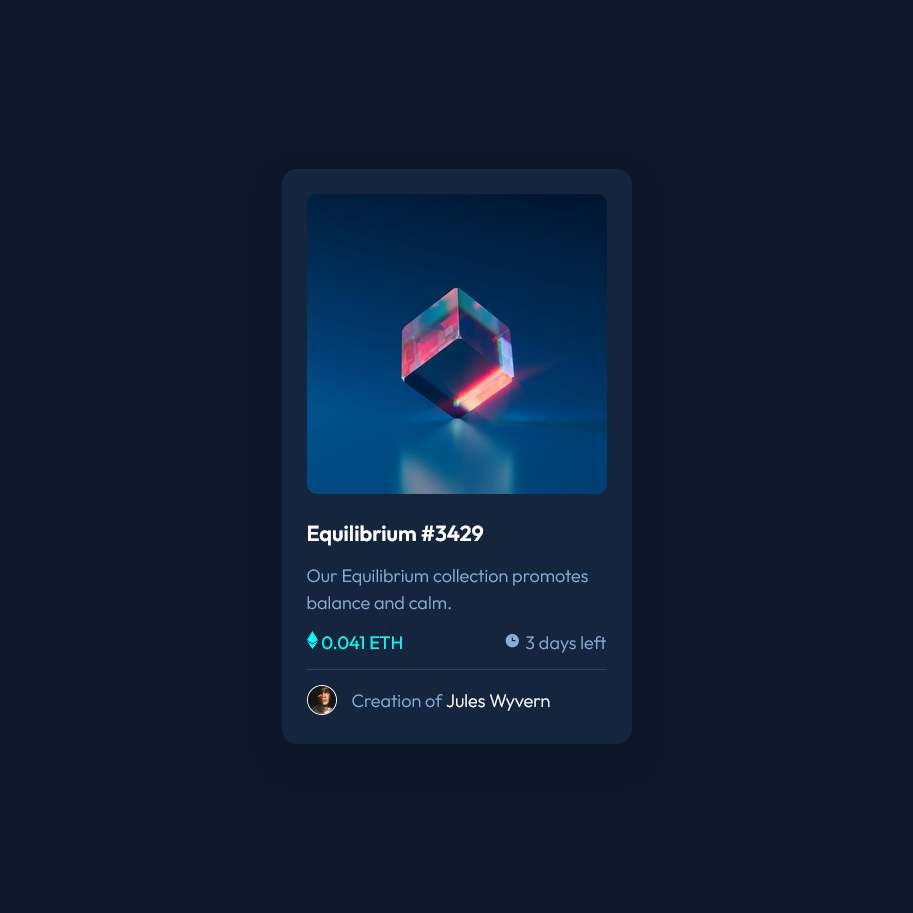

# Frontend Mentor - NFT preview card component solution

This is a solution to the [NFT preview card component challenge on Frontend Mentor](https://www.frontendmentor.io/challenges/nft-preview-card-component-SbdUL_w0U). 

## Table of contents

  - [The challenge](#the-challenge)
  - [Screenshot](#screenshot)
  - [Links](#links)
  - [Built with](#built-with)
  - [What I learned](#what-i-learned)

### The challenge

Users should be able to:

- View the optimal layout depending on their device's screen size
- See hover states for interactive elements

### Screenshot

 

### Links

- Solution URL: [Add solution URL here](https://your-solution-url.com)
- Live Site URL: [Add live site URL here](https://your-live-site-url.com)

### Built with

- Semantic HTML5 markup
- CSS custom properties
- Flexbox
- CSS Grid

### What I learned

I learned how to use flexbox and CSS grid by myself. I've been watching youtube tutorials and following Colt Steele's Web Developer Bootcamp (I highly recommend it if you're trying to learn web development) and thought this would challenge me to learn.

 This challenge helped me understand more CSS properties like box-shadow, adding an overlay to an image, creating a layout with CSS grid. I actually really enjoyed myselft in this challenge.

## Author
- Frontend Mentor - [@jacobrdz77](https://www.frontendmentor.io/profile/yourusername)
